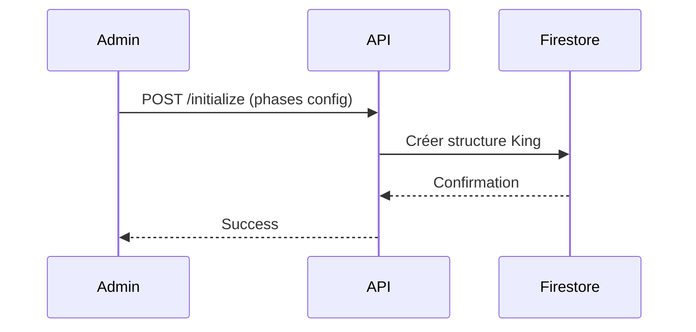
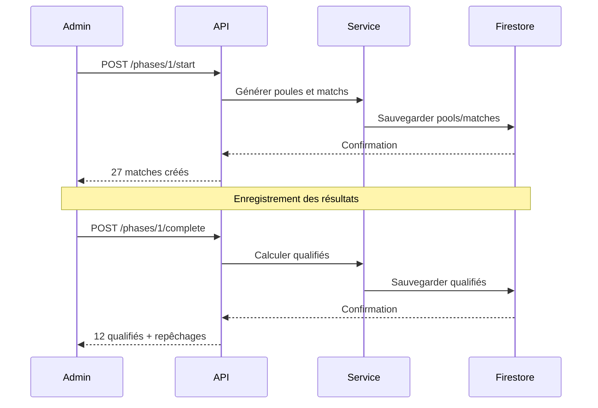
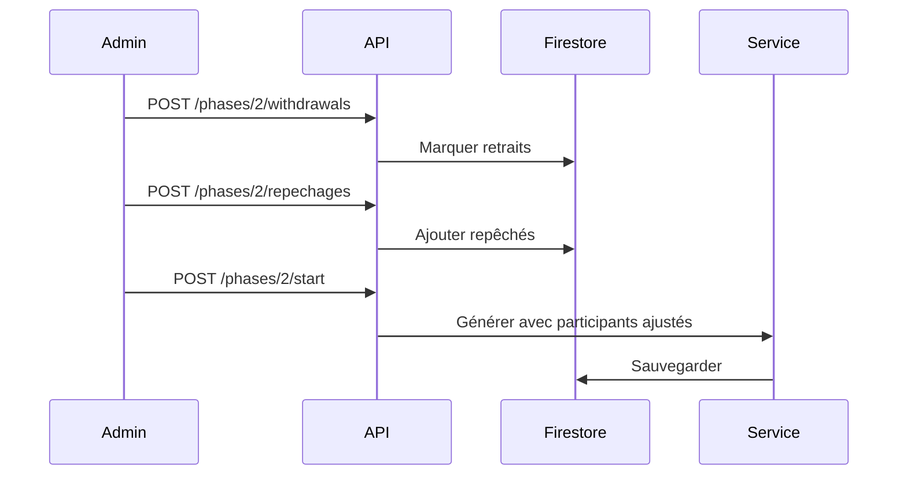

# API Flexible King Mode

## Base URL
```
/api/flexible-king
```

Tous les endpoints nécessitent une authentification admin.

## Endpoints

### 1. Get Dashboard
Récupère l'état complet du tournoi King flexible.

**Endpoint:** `GET /tournaments/:tournamentId/dashboard`

**Paramètres:**
- `tournamentId` (path) - ID du tournoi

**Réponse:**
```json
{
  "success": true,
  "data": {
    "tournament": {
      "id": "ABC123",
      "name": "Tournoi USM Beach 2025",
      "tournamentFormat": "king"
    },
    "kingData": {
      "phases": [
        {
          "id": "phase-1",
          "phaseNumber": 1,
          "status": "in_progress",
          "config": {
            "phaseNumber": 1,
            "gameMode": "4v4",
            "phaseFormat": "round-robin",
            "playersPerTeam": 4,
            "totalTeams": 9,
            "numberOfPools": 3,
            "totalQualified": 12,
            "fields": 3,
            "estimatedRounds": 3,
            "totalMatches": 27
          },
          "participantIds": ["player1", "player2", ...],
          "pools": [...],
          "matches": [...]
        }
      ],
      "currentPhaseNumber": 1
    },
    "currentPhase": {...},
    "registeredPlayersCount": 36
  }
}
```

---

### 2. Initialize Tournament
Initialise un tournoi King flexible avec les configurations de phases.

**Endpoint:** `POST /tournaments/:tournamentId/initialize`

**Corps de requête:**
```json
{
  "phases": [
    {
      "phaseNumber": 1,
      "gameMode": "4v4",
      "phaseFormat": "round-robin",
      "playersPerTeam": 4,
      "totalTeams": 9,
      "numberOfPools": 3,
      "teamsPerPool": 3,
      "qualifiedPerPool": 4,
      "totalQualified": 12,
      "fields": 3,
      "estimatedRounds": 3,
      "totalMatches": 27,
      "estimatedTime": 162,
      "setsPerMatch": 2,
      "pointsPerSet": 21,
      "tieBreakEnabled": true
    },
    {
      "phaseNumber": 2,
      "gameMode": "3v3",
      "phaseFormat": "kob",
      "playersPerTeam": 3,
      "totalTeams": 4,
      "numberOfPools": 2,
      "teamsPerPool": 2,
      "qualifiedPerPool": 4,
      "totalQualified": 8,
      "fields": 2,
      "estimatedRounds": 5,
      "totalMatches": 10,
      "estimatedTime": 100,
      "setsPerMatch": 2,
      "pointsPerSet": 21,
      "tieBreakEnabled": true
    }
  ]
}
```

**Réponse:**
```json
{
  "success": true,
  "message": "Flexible King Mode initialized successfully",
  "data": {
    "phases": [...],
    "currentPhaseNumber": null
  }
}
```

---

### 3. Update Phase Configuration
Met à jour la configuration d'une phase spécifique.

**Endpoint:** `PUT /tournaments/:tournamentId/phases/:phaseNumber/config`

**Paramètres:**
- `tournamentId` (path) - ID du tournoi
- `phaseNumber` (path) - Numéro de la phase (1, 2, 3)

**Corps de requête:**
```json
{
  "config": {
    "phaseNumber": 1,
    "gameMode": "4v4",
    "phaseFormat": "round-robin",
    "numberOfPools": 4,
    "totalQualified": 16,
    "poolDistribution": [3, 3, 2, 2],
    "qualifiedPerPoolDistribution": [4, 4, 4, 4],
    ...
  }
}
```

**Réponse:**
```json
{
  "success": true,
  "message": "Phase 1 configuration updated successfully"
}
```

---

### 4. Start Phase
Démarre une phase en générant les poules et matchs.

**Endpoint:** `POST /tournaments/:tournamentId/phases/:phaseNumber/start`

**Paramètres:**
- `tournamentId` (path) - ID du tournoi
- `phaseNumber` (path) - Numéro de la phase

**Comportement:**
- **Phase 1**: Utilise tous les joueurs inscrits
- **Phases suivantes**: Utilise les qualifiés de la phase précédente

**Réponse:**
```json
{
  "success": true,
  "message": "Phase 1 started! 27 matches to play.",
  "data": {
    "pools": [
      {
        "id": "pool-A",
        "name": "Poule A",
        "players": [...],
        "playerCount": 12
      }
    ],
    "matchesCount": 27
  }
}
```

**Erreurs possibles:**
```json
{
  "success": false,
  "message": "Phase 1 is already in_progress"
}
```
```json
{
  "success": false,
  "message": "Previous phase 1 must be completed first"
}
```

---

### 5. Complete Phase
Termine une phase et calcule les joueurs qualifiés.

**Endpoint:** `POST /tournaments/:tournamentId/phases/:phaseNumber/complete`

**Paramètres:**
- `tournamentId` (path) - ID du tournoi
- `phaseNumber` (path) - Numéro de la phase

**Prérequis:**
- Tous les matchs de la phase doivent être complétés

**Réponse:**
```json
{
  "success": true,
  "message": "Phase 1 completed successfully",
  "data": {
    "qualifiedIds": [
      "player1",
      "player5",
      "player8",
      "player12",
      "player15",
      "player18",
      "player23",
      "player27",
      "player30",
      "player33",
      "player35",
      "player36"
    ],
    "qualifiedCount": 12,
    "repechageCandidates": [
      {
        "playerId": "player13",
        "playerPseudo": "Michel",
        "rank": 13,
        "wins": 6,
        "losses": 3
      },
      {
        "playerId": "player22",
        "playerPseudo": "Sophie",
        "rank": 14,
        "wins": 5,
        "losses": 4
      }
    ],
    "ranking": [
      {
        "playerId": "player1",
        "playerPseudo": "John",
        "rank": 1,
        "wins": 9,
        "losses": 0,
        "setsWon": 18,
        "setsLost": 2
      }
    ]
  }
}
```

**Erreurs possibles:**
```json
{
  "success": false,
  "message": "3 matches still incomplete"
}
```

---

### 6. Manage Withdrawals
Gère les joueurs retirés d'une phase.

**Endpoint:** `POST /tournaments/:tournamentId/phases/:phaseNumber/withdrawals`

**Paramètres:**
- `tournamentId` (path) - ID du tournoi
- `phaseNumber` (path) - Numéro de la phase

**Corps de requête:**
```json
{
  "withdrawnPlayerIds": [
    "player5",
    "player12"
  ]
}
```

**Réponse:**
```json
{
  "success": true,
  "message": "Withdrawals updated successfully",
  "data": {
    "withdrawnCount": 2
  }
}
```

---

### 7. Manage Repechages
Gère les joueurs repêchés pour une phase.

**Endpoint:** `POST /tournaments/:tournamentId/phases/:phaseNumber/repechages`

**Paramètres:**
- `tournamentId` (path) - ID du tournoi
- `phaseNumber` (path) - Numéro de la phase

**Corps de requête:**
```json
{
  "repechedPlayerIds": [
    "player13",
    "player14"
  ]
}
```

**Comportement:**
- Ajoute les joueurs repêchés à la liste des participants
- Les joueurs repêchés remplacent les joueurs retirés

**Réponse:**
```json
{
  "success": true,
  "message": "Repechages updated successfully",
  "data": {
    "repechedCount": 2,
    "totalParticipants": 14
  }
}
```

---

### 8. Reset Phase
Réinitialise complètement une phase.

**Endpoint:** `POST /tournaments/:tournamentId/phases/:phaseNumber/reset`

**Paramètres:**
- `tournamentId` (path) - ID du tournoi
- `phaseNumber` (path) - Numéro de la phase

**Comportement:**
- Supprime toutes les poules et matchs
- Réinitialise les IDs de participants et qualifiés
- Change le statut à `configured`

**Réponse:**
```json
{
  "success": true,
  "message": "Phase 1 reset successfully"
}
```

---

## Codes d'erreur

| Code | Message | Description |
|------|---------|-------------|
| 400 | Phases configuration is required | Corps de requête manquant ou invalide |
| 400 | Phase 1 must be completed first | Tentative de démarrage d'une phase alors que la précédente n'est pas terminée |
| 400 | 3 matches still incomplete | Tentative de complétion d'une phase avec matchs incomplets |
| 404 | Tournament not found | Tournoi non trouvé |
| 404 | Phase 2 not found | Phase non trouvée |
| 404 | Flexible King Mode not initialized | Mode King flexible pas initialisé pour ce tournoi |
| 500 | Error loading flexible King dashboard | Erreur serveur lors du chargement |

---

## Workflow Type

### Configuration Initiale


### Déroulement d'une Phase


### Gestion Repêchages


---

## Exemples d'utilisation

### TypeScript/JavaScript

```typescript
// Initialisation
const initResponse = await fetch('/api/flexible-king/tournaments/ABC123/initialize', {
  method: 'POST',
  headers: {
    'Content-Type': 'application/json',
    'Authorization': `Bearer ${adminToken}`
  },
  body: JSON.stringify({
    phases: kingConfig.phases
  })
});

// Démarrage phase 1
await fetch('/api/flexible-king/tournaments/ABC123/phases/1/start', {
  method: 'POST',
  headers: { 'Authorization': `Bearer ${adminToken}` }
});

// Récupération dashboard
const dashboardResponse = await fetch('/api/flexible-king/tournaments/ABC123/dashboard', {
  headers: { 'Authorization': `Bearer ${adminToken}` }
});
const { data } = await dashboardResponse.json();

// Complétion phase
const completeResponse = await fetch('/api/flexible-king/tournaments/ABC123/phases/1/complete', {
  method: 'POST',
  headers: { 'Authorization': `Bearer ${adminToken}` }
});
const { data: { qualifiedIds, repechageCandidates } } = await completeResponse.json();

// Repêchages
await fetch('/api/flexible-king/tournaments/ABC123/phases/2/repechages', {
  method: 'POST',
  headers: {
    'Content-Type': 'application/json',
    'Authorization': `Bearer ${adminToken}`
  },
  body: JSON.stringify({
    repechedPlayerIds: repechageCandidates.slice(0, 2).map(c => c.playerId)
  })
});
```

### cURL

```bash
# Initialisation
curl -X POST http://localhost:3000/api/flexible-king/tournaments/ABC123/initialize \
  -H "Content-Type: application/json" \
  -H "Authorization: Bearer $ADMIN_TOKEN" \
  -d '{"phases":[...]}'

# Démarrage phase 1
curl -X POST http://localhost:3000/api/flexible-king/tournaments/ABC123/phases/1/start \
  -H "Authorization: Bearer $ADMIN_TOKEN"

# Dashboard
curl http://localhost:3000/api/flexible-king/tournaments/ABC123/dashboard \
  -H "Authorization: Bearer $ADMIN_TOKEN"

# Complétion
curl -X POST http://localhost:3000/api/flexible-king/tournaments/ABC123/phases/1/complete \
  -H "Authorization: Bearer $ADMIN_TOKEN"

# Repêchages
curl -X POST http://localhost:3000/api/flexible-king/tournaments/ABC123/phases/2/repechages \
  -H "Content-Type: application/json" \
  -H "Authorization: Bearer $ADMIN_TOKEN" \
  -d '{"repechedPlayerIds":["player13","player14"]}'

# Reset
curl -X POST http://localhost:3000/api/flexible-king/tournaments/ABC123/phases/1/reset \
  -H "Authorization: Bearer $ADMIN_TOKEN"
```

---

## Notes Importantes

1. **Ordre des opérations**: Les phases doivent être complétées dans l'ordre (1 → 2 → 3)

2. **Gestion des joueurs**: `totalQualified` et `qualifiedPerPool` représentent toujours des JOUEURS, pas des équipes

3. **Validation automatique**: Le système vérifie que le nombre de qualifiés d'une phase correspond au nombre de participants attendus pour la phase suivante

4. **Atomicité**: Toutes les opérations utilisent des batch writes Firestore pour garantir la cohérence

5. **Repêchages**: Les repêchages doivent être gérés AVANT le démarrage de la phase suivante
